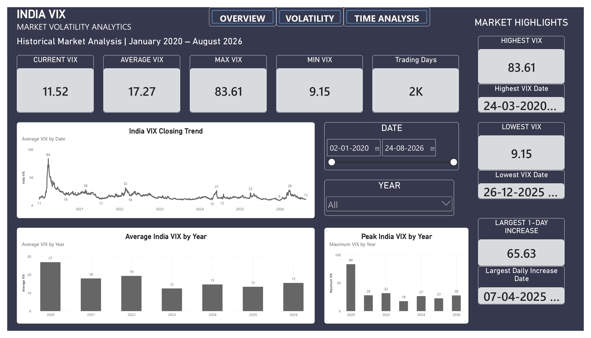
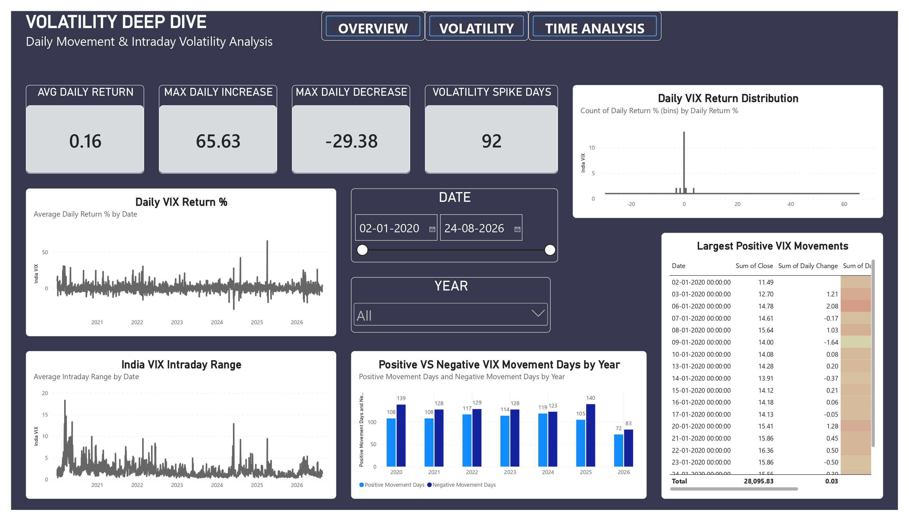
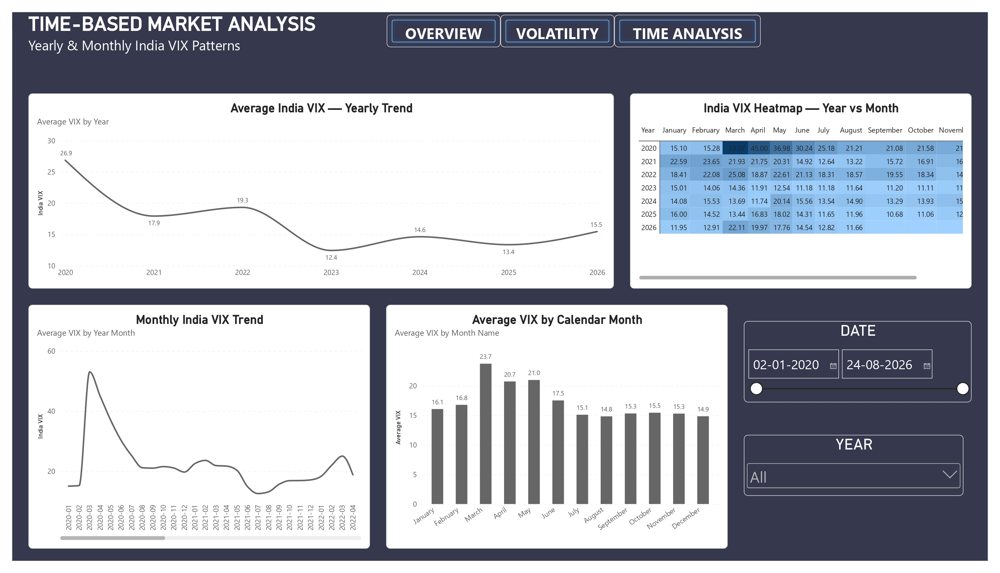
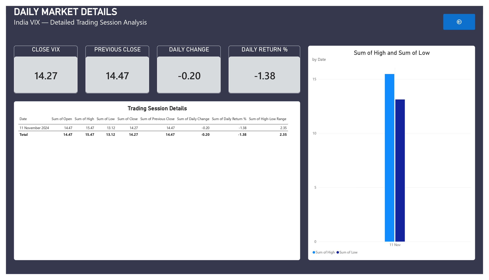

# India VIX Market Data Analysis

An interactive Power BI dashboard for analyzing historical India VIX market volatility, daily movements, yearly trends, monthly patterns, and trading-session details.

## Project Overview

This project presents an interactive market volatility analytics dashboard built using Microsoft Power BI.

The analysis covers historical India VIX data from **January 2020 to August 2026** and provides multiple views of market volatility through trend analysis, daily movement analysis, yearly comparisons, monthly patterns, and detailed trading-session information.

## Project Objective

The objective of this project is to transform historical India VIX market data into meaningful visual insights that help understand:

- Market volatility trends
- Daily VIX movements
- Volatility spikes
- Positive and negative movement days
- Yearly volatility patterns
- Monthly volatility patterns
- Intraday volatility ranges
- Individual trading-session details

## Key Metrics

| Metric | Value |
|---|---:|
| Current VIX | 11.52 |
| Average VIX | 17.27 |
| Maximum VIX | 83.61 |
| Minimum VIX | 9.15 |
| Trading Days | 2K |
| Average Daily Return | 0.16 |
| Maximum Daily Increase | 65.63 |
| Maximum Daily Decrease | -29.38 |
| Volatility Spike Days | 92 |

## Dashboard Pages

### 1. Market Overview

Provides a high-level view of India VIX performance, including:

- Current VIX
- Average VIX
- Maximum VIX
- Minimum VIX
- Trading days
- India VIX closing trend
- Average VIX by year
- Peak India VIX by year
- Highest and lowest VIX dates
- Largest daily increase

The maximum recorded VIX shown in the dashboard is **83.61**, while the minimum is **9.15**.

### 2. Volatility Deep Dive

Analyzes daily VIX movements and volatility behavior through:

- Daily VIX return percentage
- Intraday range
- Positive vs negative movement days
- Daily return distribution
- Largest positive VIX movements
- Volatility spike analysis

The dashboard shows **92 volatility spike days**, with a maximum daily increase of **65.63** and maximum daily decrease of **-29.38**.

### 3. Time-Based Market Analysis

Analyzes India VIX patterns across different time periods:

- Average VIX by year
- Monthly India VIX trend
- Average VIX by calendar month
- Year-month volatility heatmap

The yearly average VIX shown in the dashboard varies significantly across the analyzed period, with 2020 showing the highest yearly average among the displayed years.

### 4. Daily Market Details

Provides detailed trading-session analysis using:

- Close VIX
- Previous Close
- Daily Change
- Daily Return %
- High-Low range
- Trading session details

The detailed page allows individual trading-session values to be examined.

## Key Insights

Based on the dashboard analysis:

- India VIX reached a maximum of **83.61** during the analyzed period.
- The minimum VIX shown is **9.15**.
- The average VIX across the analyzed period is **17.27**.
- The dashboard records a maximum daily increase of **65.63**.
- The maximum daily decrease shown is **-29.38**.
- Volatility behavior varies significantly across different years and months.
- The yearly and monthly analysis helps identify periods of relatively higher and lower market volatility.
- The volatility heatmap provides a year-by-month view of India VIX behavior.

## Project Workflow

```text
Raw India VIX Dataset
        ↓
Data Cleaning
        ↓
Data Transformation
        ↓
Data Modeling
        ↓
DAX Measures
        ↓
Data Analysis
        ↓
Data Visualization
        ↓
Interactive Power BI Dashboard
        ↓
Market Volatility Insights
```

## Tools & Technologies

- Microsoft Power BI
- Power Query
- DAX
- Microsoft Excel
- CSV
- Data Cleaning
- Data Transformation
- Data Modeling
- Data Visualization
- Market Data Analytics

## Project Structure

```text
IndiaVIX-Market-Data-Analysis/
│
├── Dataset/
│   ├── India VIX.csv
│   ├── IndiaVIX_Cleaned_Dataset.xlsx
│   └── IndiaVIX_Data_Dictionary.xlsx
│
├── PowerBI/
│   └── IndiaVIX_Market Data Analysis.pbix
│
├── Dashboard/
│   └── IndiaVIX_Market Data Analysis_Dashboards.pdf
│
├── Documentation/
│   └── IndiaVIX_Project Report.pdf
│
├── DAX/
│   └── Dax_Mesures.pdf
│
├── .gitignore
└── README.md
```

## Dashboard Preview

### 1. Market Overview



### 2. Volatility Deep Dive



### 3. Time-Based Market Analysis



### 4. Daily Market Details



## How to Use

1. Download or clone this repository.
2. Open the `.pbix` file from the `PowerBI` folder using Microsoft Power BI Desktop.
3. If required, update the dataset source path.
4. Refresh the data.
5. Use the available date and year filters.
6. Navigate through the dashboard pages to explore India VIX volatility patterns.

## Documentation

The repository includes:

- Raw India VIX dataset
- Cleaned dataset
- Data dictionary
- DAX measures
- Power BI dashboard
- Dashboard documentation
- Project report

## Future Improvements

- Add volatility regime classification
- Add event-based market volatility analysis
- Add rolling volatility indicators
- Add additional year-over-year comparisons
- Add advanced drill-through analysis
- Add automated data refresh
- Add correlation analysis with major market indices

## 👩‍💻 Author

**Tanya Sinha**

Data Analytics | Power BI | DAX | Data Visualization
